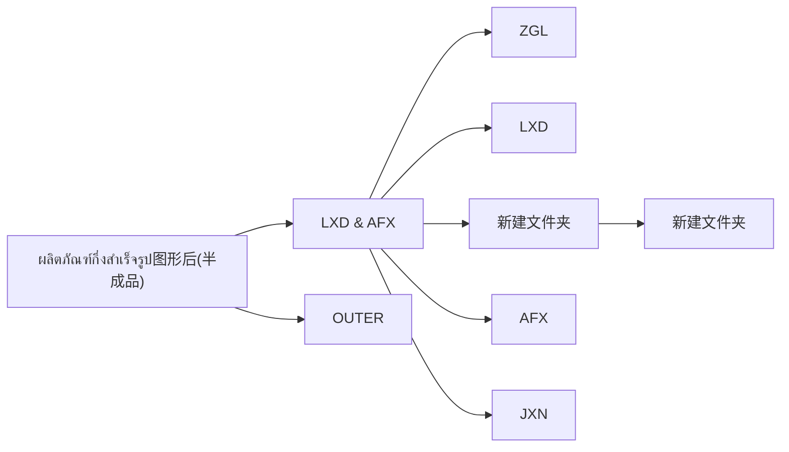
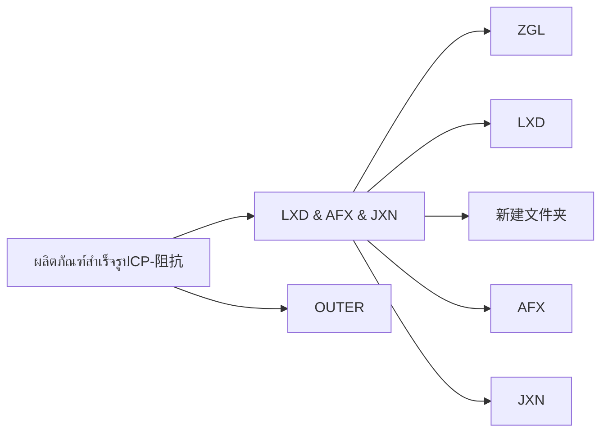

# 阻抗共享盘脚本需求说明

## 1. 共享盘资料

- 共享盘地址：`\\10.0.8.252`
- 账号：由管理员提供
- 密码：由管理员提供
- 目标根目录：`\\10.0.8.252\ProductionFieldFile 现场公共盘\阻抗`

> 注意：账号密码应保存在本地配置文件、环境变量或运行时输入中，不要写入项目文档或代码。

## 2. 目标目录入口

在 `\\10.0.8.252\ProductionFieldFile 现场公共盘\阻抗` 下，目前需要处理两个一级产品目录：

1. `ผลิตภัณฑ์กึ่งสำเร็จรูป图形后(半成品)`
2. `ผลิตภัณฑ์สำเร็จรูปCP-阻抗`

## 3. 目录结构资料

### 3.1 图形后半成品目录

路径：

```text
\\10.0.8.252\ProductionFieldFile 现场公共盘\阻抗\ผลิตภัณฑ์กึ่งสำเร็จรูป图形后(半成品)
```

该目录下包含：

- `LXD & AFX`
- `OUTER`

其中 `LXD & AFX` 下继续包含：

- `ZGL`
- `LXD`
- `新建文件夹`
  - `新建文件夹`
- `AFX`
- `JXN`

目录流程：



### 3.2 CP 阻抗成品目录

路径：

```text
\\10.0.8.252\ProductionFieldFile 现场公共盘\阻抗\ผลิตภัณฑ์สำเร็จรูปCP-阻抗
```

该目录下包含：

- `LXD & AFX & JXN`
- `OUTER`

其中 `LXD & AFX & JXN` 下继续包含：

- `ZGL`
- `LXD`
- `新建文件夹`
- `AFX`
- `JXN`

目录流程：



## 4. 脚本需求

### 4.1 基础连接能力

- 脚本需要能够访问共享盘 `\\10.0.8.252`。
- 访问共享盘时使用管理员提供的共享盘账号和密码。
- 脚本需要支持访问中文、泰文、英文混合命名的目录。
- 脚本需要优先检查目标根目录是否存在：

```text
\\10.0.8.252\ProductionFieldFile 现场公共盘\阻抗
```

### 4.2 文件匹配规则

#### 4.2.1 基础文件过滤

- 主要匹配 Excel 文件。
- 需要优先支持以下 Excel 扩展名：
  - `.xlsx`
  - `.xls`
- 可预留支持：
  - `.xlsm`
  - `.csv`
- 脚本扫描文件时应忽略临时 Excel 文件，例如文件名以 `~$` 开头的文件。
- 文件扩展名判断需要忽略大小写，例如 `.XLSX`、`.XLS` 也应被识别。
- 文件必须是真实文件，不能是文件夹。
- 文件路径必须位于本需求中定义的阻抗共享盘扫描目录内。
- 如果文件无法读取、被占用或没有权限访问，需要记录到日志，不进入上传列表。

#### 4.2.2 日期窗口规则

- 文件筛选规则按日期执行。
- 最基础规则：按文件时间戳筛选需要上传的文件。
- 默认上传前一天的文件。例如今天是 `2026-06-14`，则上传文件时间戳日期为 `2026-06-13` 的所有符合条件 Excel 文件。
- 日期窗口建议使用左闭右开区间：

```text
目标日期 00:00:00 <= 文件修改时间 < 次日 00:00:00
```

- 示例：脚本在 `2026-06-14` 运行，则目标日期为 `2026-06-13`，筛选范围为：

```text
2026-06-13 00:00:00 <= 文件修改时间 < 2026-06-14 00:00:00
```

- 时间按 `Asia/Shanghai` 时区理解。
- 脚本需要提供 `day_offset` 参数，默认值为 `1`，表示处理前一天文件。
- 文件修改时间是允许上传的前置条件。只有文件修改时间落在目标日期窗口内，才允许进入后续解析、去重和上传流程。
- 上传任务每天只执行一次，执行时间为每天早上 `08:00`。
- 因为当天文件仍可能被继续修改，所以当天文件不上传，统一在次日 `08:00` 按时间戳窗口处理前一天文件。
- 监听到的文件变化不能绕过日期窗口规则，也不能直接触发上传。

#### 4.2.3 扫描范围规则

- 默认从阻抗根目录扫描：

```text
\\10.0.8.252\ProductionFieldFile 现场公共盘\阻抗
```

- 默认只处理以下两个一级目录：
  - `ผลิตภัณฑ์กึ่งสำเร็จรูป图形后(半成品)`
  - `ผลิตภัณฑ์สำเร็จรูปCP-阻抗`
- 扫描需要支持递归进入子目录。
- 后续脚本建议提供是否递归扫描的配置，默认 `recursive=true`。
- 如果后续需要缩小范围，可以配置只扫描指定目标子目录。

#### 4.2.4 排除目录规则

- 扫描时需要跳过日志目录，避免把日志文件当作业务文件处理：

```text
\\10.0.8.252\File\ZK_LOG
```

- 扫描时也需要跳过明显非业务目录，例如：
  - `LOG`
  - `log`
  - `日志`
  - `备份`
  - `backup`
- 排除目录按目录名称匹配即可，不需要匹配完整路径。

#### 4.2.5 路径去重规则

- 如果多个扫描入口最终扫描到同一个文件，需要按标准化后的完整路径去重。
- 路径标准化建议包含：
  - 统一路径分隔符；
  - 去除多余空格；
  - 忽略大小写差异；
  - 转换为绝对路径。
- 同一个物理文件只允许进入候选列表一次。

#### 4.2.6 区域识别规则

- 脚本需要根据文件所在目录识别区域。
- 支持识别的区域包括：
  - `AFX`
  - `JXN`
  - `LXD`
  - `OUTER`
  - `ZGL`
- 组合目录需要转换成稳定区域名：

| 原目录名 | 识别区域名 |
| --- | --- |
| `LXD & AFX` | `LXD_AFX` |
| `LXD & AFX & JXN` | `LXD_AFX_JXN` |

- 如果无法从路径中识别区域，则区域记录为 `UNKNOWN`。
- 区域信息需要写入扫描清单和日志，方便后续排查。

#### 4.2.7 文件名标准化规则

- 文件名标准化用于生成去重键和日志字段，不改变原始文件名。
- 建议规则：
  - 去掉扩展名；
  - 转成大写；
  - 中文括号转英文括号；
  - 空白字符替换为 `-`；
  - 下划线 `_` 替换为 `-`；
  - 去掉结尾类似 `(1)` 的副本编号；
  - 合并连续多个 `-`。
- 标准化后的文件名只用于脚本内部判断，上传时仍使用原始文件。

#### 4.2.8 批内去重规则

- 同一轮扫描中，如果发现疑似重复文件，需要先做批内去重。
- 批内去重建议优先使用以下组合：
  - 区域；
  - 标准化文件名；
  - 文件大小；
  - 文件修改时间；
  - 文件内容 hash。
- 如果同一组内出现多个候选文件，默认保留文件修改时间最新的一个。
- 被批内去重跳过的文件需要记录到日志，动作类型建议为 `batch_duplicate_skipped`。

#### 4.2.9 相同内容去重规则

- 如果不同目录或不同区域下出现内容完全相同的 Excel 文件，需要避免重复上传。
- `.xlsx` 文件可以优先尝试计算 Excel 内容 hash。
- `.xls` 文件可以使用二进制文件 hash。
- 如果无法计算 Excel 内容 hash，则退回使用二进制文件 hash。
- 内容完全相同的文件默认保留修改时间最新的一个。
- 被相同内容去重跳过的文件需要记录到日志，动作类型建议为：
  - `same_binary_skipped`
  - `same_excel_content_skipped`

#### 4.2.10 历史成功记录去重规则

- 上传前需要读取历史成功日志。
- 如果文件在历史日志中已经有 `upload_success` 记录，则本次跳过。
- 历史去重建议使用以下信息组合判断：
  - 文件完整路径；
  - 文件名；
  - 文件修改时间；
  - 文件大小；
  - 文件内容 hash。
- 如果日志中能找到同一文件的成功上传记录，动作类型记录为 `history_uploaded_skipped`。
- 如果文件名相同，但修改时间、文件大小或 hash 发生变化，则视为不同版本文件。
- 不同版本文件仍必须满足目标日期时间戳窗口，满足后才允许进入上传流程。

#### 4.2.11 上传数量限制和预演模式

- 脚本建议预留单次最大上传数量配置，例如 `max_upload_files`。
- 默认不限制单次上传数量，即 `max_upload_files=null`。
- 如果达到上传数量限制，剩余文件不上传，但需要写入日志，动作类型建议为 `upload_limit_skipped`。
- 脚本建议预留 dry-run 预演模式。
- dry-run 默认关闭，即 `dry_run=false`。
- dry-run 模式下只执行扫描、筛选、去重和生成清单，不真正调用上传接口，也不写入成功上传记录。

### 4.3 目录扫描能力

- 脚本需要从阻抗根目录开始扫描。
- 脚本需要识别并进入以下两个一级目录：
  - `ผลิตภัณฑ์กึ่งสำเร็จรูป图形后(半成品)`
  - `ผลิตภัณฑ์สำเร็จรูปCP-阻抗`
- 脚本需要按上方流程图所示的目录层级继续扫描子目录。
- 扫描时需要保留完整路径，方便后续定位文件。

### 4.4 文件上传能力

脚本需要将扫描到的 Excel 文件上传到接口。

接口信息：

```text
请求方法：POST
请求地址：http://10.0.8.217:8108/service-qms/file/importImpedanceData
请求协议：http/1.1
请求体类型：multipart/form-data
接口名称：导入现场阻抗测量记录
```

form-data 参数：

| 参数名 | 类型 | 是否必填 | 说明 |
| --- | --- | --- | --- |
| `file` | file | 是 | 需要上传的 Excel 文件 |
| `serialNo` | string | 否 | 当前脚本不需要对 `serialNo` 取值或赋值 |

上传要求：

- 每个匹配到的 Excel 文件需要作为 `file` 参数上传。
- 当前脚本不需要处理 `serialNo`，不从文件名、Excel 内容或目录名称解析 `serialNo`。
- 扫描到符合条件的 Excel 文件后，直接通过接口上传。
- 上传成功后，系统页面可在阻抗查询中查到导入后的记录，例如按批次号查询后显示规格、最大值、最小值、平均值、结果、CPK 等字段。
- 如果文件已经上传成功，后续再次运行脚本时需要跳过，不重复上传。
- 判断是否已经上传成功，优先依据日志中的成功记录。
- 上传成功后需要记录接口返回结果。
- 上传失败时需要记录失败文件路径、HTTP 状态码、接口返回内容和失败原因。
- 上传过程建议支持重试，避免网络波动导致单次失败。
- 上传时需要跳过 Excel 临时文件。
- 上传成功后不需要移动、重命名或标记原始文件。

Python 请求示例方向：

```python
import requests

url = "http://10.0.8.217:8108/service-qms/file/importImpedanceData"

with open(excel_path, "rb") as f:
    files = {
        "file": (excel_name, f),
    }
    response = requests.post(url, files=files, timeout=60)
```

### 4.5 已上传文件跳过规则

- 脚本每次运行前需要读取历史日志。
- 如果某个文件已经有上传成功记录，则本次跳过该文件。
- 跳过判断建议至少包含：
  - 文件完整路径；
  - 文件名；
  - 文件修改时间；
  - 文件大小。
- 如果同名文件发生变化，例如修改时间、文件大小或 hash 变化，则视为不同版本文件。
- 不同版本文件仍必须满足目标日期时间戳窗口，满足后才允许进入上传流程。

### 4.6 日志记录

- 上传完成后必须记录日志。
- 日志存储目录：

```text
\\10.0.8.252\File\ZK_LOG
```

- 建议脚本中将日志目录做成配置项，例如 `log_dir`，避免目录名调整时改代码。
- 日志需要记录扫描、上传、跳过、失败等信息。
- 建议日志按日期生成，例如：

```text
\\10.0.8.252\File\ZK_LOG\impedance_upload_2026-06-14.log
```

- 每条日志建议包含：
  - 运行时间；
  - 文件完整路径；
  - 文件名；
  - 文件修改时间；
  - 文件大小；
  - 文件 hash；
  - 区域；
  - 标准化文件名；
  - 动作类型：`scan`、`upload_success`、`upload_failed`、`skip_uploaded`、`batch_duplicate_skipped`、`same_binary_skipped`、`same_excel_content_skipped`、`history_uploaded_skipped`、`upload_limit_skipped`；
  - HTTP 状态码；
  - 接口返回内容；
  - 错误信息。

### 4.7 异常处理

- 如果共享盘无法连接，需要输出清晰错误信息。
- 如果账号密码错误，需要提示认证失败。
- 如果某个目录不存在，需要记录缺失目录路径。
- 如果遇到无权限访问的目录，需要记录但不中断整个扫描流程。
- 如果目录名称中包含中文、泰文或特殊字符，脚本不应出现编码错误。
- 如果接口无法连接，需要记录接口地址和网络错误信息。
- 如果接口返回非成功状态码，需要记录状态码和响应内容。
- 如果单个文件上传失败，不应中断其他文件上传。
- 如果日志目录无法访问，需要在控制台输出错误，并停止上传，避免无法判断历史成功记录导致重复上传。

### 4.8 输出结果

脚本运行后建议输出以下信息：

- 已成功连接的共享盘地址。
- 已扫描的一级目录名称。
- 每个目录下扫描到的子目录列表。
- 缺失目录列表。
- 无权限或访问失败目录列表。
- 后续需要处理的文件完整路径列表。
- 匹配到的 Excel 文件数量。
- 已上传成功文件列表。
- 上传失败文件列表。
- 已跳过文件列表。
- 接口返回结果摘要。
- 日志文件路径。

### 4.9 脚本最终动作

脚本最终需要完成以下动作：

1. 每天早上 `08:00` 定时执行一次上传任务。
2. 扫描共享盘中符合日期规则和文件类型规则的 Excel 文件，并生成清单。
3. 日期时间戳是上传前置条件，只有目标日期窗口内的文件才能上传。
4. 通过接口将共享盘中符合规则的 Excel 文件上传。
5. 如果文件已经上传成功，则根据历史日志跳过。
6. 上传完成后写入日志，日志保存到 `\\10.0.8.252\File\ZK_LOG`。
7. 上传成功后不移动、不重命名、不标记原始文件。
8. 监听模块只做文件变化提醒和日志记录，不触发上传。

### 4.10 代码风格和维护性要求

- 脚本代码需要使用最简单、直接、容易理解的写法。
- 不追求复杂框架，不做过度封装。
- 不能把所有逻辑堆在一个大函数或一个大脚本中，需要按职责拆分模块。
- 每个模块只做一类事情，方便后续维护和排查问题。
- 函数命名要清晰，能直接表达用途。
- 配置项集中管理，例如共享盘路径、日志路径、接口地址、执行时间、文件扩展名、排除目录等。
- 业务规则不要散落在代码各处，日期规则、去重规则、上传规则、监听规则需要放在清晰的位置。
- 日志记录要统一入口，避免每个模块各写各的格式。
- 异常处理要简单明确，能继续处理其他文件时不要中断整个任务。
- 代码注释只写关键业务规则和容易误解的地方，不堆砌无意义注释。
- 第一版以稳定、可读、可维护为优先，不做复杂并发和复杂任务调度。

### 4.11 模块划分

脚本建议按以下模块拆分，后续编码时每个模块保持职责单一。

#### 4.11.1 扫描模块

- 负责连接共享盘。
- 负责从阻抗根目录开始扫描文件和文件夹。
- 负责处理递归扫描、排除目录、扩展名过滤、临时文件过滤。
- 输出候选文件原始清单。
- 不负责解析文件名、不负责去重、不负责上传。

#### 4.11.2 解析模块

- 负责解析扫描模块输出的候选文件。
- 负责识别区域，例如 `AFX`、`JXN`、`LXD`、`OUTER`、`ZGL`。
- 负责标准化文件名。
- 负责提取或生成 `business_key`、`fallback_key`、`dedupe_key`。
- 当前脚本不处理接口参数 `serialNo`。

#### 4.11.3 去重模块

- 负责批内去重。
- 负责相同内容去重。
- 负责读取历史成功记录并跳过已上传文件。
- 负责判断文件是否进入定时上传任务列表。
- 输出待上传文件列表和跳过文件列表。

#### 4.11.4 上传模块

- 负责调用接口上传 Excel 文件。
- 接口地址：

```text
http://10.0.8.217:8108/service-qms/file/importImpedanceData
```

- 负责处理 HTTP 状态码、接口响应、超时、重试。
- 上传成功后返回接口响应结果。
- 上传失败时返回失败原因，不中断其他文件上传。

#### 4.11.5 记录模块

- 负责写入运行日志、上传流水、历史成功索引和汇总文件。
- 负责维护已经上传成功的文件记录，供后续运行跳过。
- 日志建议使用 JSON / JSONL，方便后续脚本读取和追踪。
- 参考现有文件：
  - `summary_2026-06-12_19-47-41.json`
  - `upload_log_2026-06-12.jsonl`
  - `uploaded_file_fingerprints.json`
  - `uploaded_business_keys.json`

#### 4.11.6 监听模块

- 负责监听阻抗目录下文件和文件夹变化。
- 监听目标根目录：

```text
\\10.0.8.252\ProductionFieldFile 现场公共盘\阻抗
```

- 监听范围包括该目录下所有文件和文件夹。
- 监听模块只负责提醒和记录，不负责上传。
- 监听到新增、修改、重命名、删除等事件后，只写入监听日志或提醒信息。
- 监听事件不能直接进入上传流程，不能直接调用上传接口。
- 监听模块可以记录文件是否仍在变化，但不需要等待文件稳定后上传。
- 真正上传只能由每天早上 `08:00` 的定时扫描任务触发。

#### 4.11.7 队列模块

- 队列模块只服务于定时上传任务，不接收监听模块产生的上传任务。
- 负责对定时扫描得到的待上传文件进行排队、限速、去重、失败重试。
- 同一个文件在同一次定时任务中只允许出现一次。
- 队列模块将任务交给解析、去重、上传、记录流程处理。
- 监听模块如需提醒，可使用单独的提醒队列或提醒日志，不与上传队列混用。

### 4.12 监听功能设计讨论

需要添加对以下路径中所有文件和文件夹的监听功能：

```text
\\10.0.8.252\ProductionFieldFile 现场公共盘\阻抗
```

监听功能建议这样写进需求文档：

- 监听范围：阻抗根目录下所有子目录、文件。
- 监听事件：文件新增、文件修改、文件重命名、文件删除、目录新增、目录重命名。
- 监听用途：只做提醒和记录，不上传文件。
- 处理对象：监听可以记录所有文件夹和文件事件，但只有 Excel 文件事件需要重点提醒。
- 防重复提醒：同一个文件短时间内多次触发事件时，可以合并为一条提醒记录。
- 上传边界：监听事件不得直接触发上传，上传只能由每天一次的定时扫描任务触发。
- 定时扫描：每天早上 `08:00` 扫描前一天文件，并执行解析、去重、上传、记录。
- 日志记录：监听事件本身也需要写日志，例如 `watch_created`、`watch_modified`、`watch_renamed`、`watch_deleted`、`watch_notice`。
- 提醒方式建议第一版采用“监听日志 + 每日汇总”：
  - 监听日志记录所有文件夹和文件变化事件；
  - 每天上传任务执行前或执行后生成监听汇总；
  - 汇总内容包括新增文件数量、修改文件数量、删除文件数量、重命名文件数量、重点 Excel 文件变化列表；
  - 第一版先不做弹窗、邮件、企业微信，降低误报和维护成本；
  - 后续如果需要实时通知，再接入企业微信机器人或邮件。
- 失败处理：监听中断或共享盘断开时，需要记录错误，并尝试恢复；恢复后继续监听即可，不触发补偿上传。

监听功能当前定位为提醒能力，不作为上传触发器。后续实现时再决定使用轮询扫描、文件系统事件监听，或两者结合。

### 4.13 日志输出格式

这里的“文件输出格式”主要指日志和运行结果文件的格式。可以参考现有的四类文件。

#### 4.13.1 运行汇总文件

文件名示例：

```text
summary_2026-06-12_19-47-41.json
```

用途：

- 记录一次脚本运行的总体结果。
- 适合保存 `run_id`、运行时间、目标日期、候选文件数量、上传成功数量、失败数量、跳过数量。

建议字段：

```json
{
  "run_id": "ZK-20260612-194625",
  "run_time": "2026-06-12 19:47:41",
  "target_day": "2026-06-11",
  "stats": {
    "task_status": "completed",
    "candidate_count": 20,
    "selected_count": 19,
    "success_count": 1,
    "fail_count": 0,
    "skip_count": 1,
    "pending_count": 0
  },
  "failed_files": [],
  "pending_files": []
}
```

#### 4.13.2 上传流水日志

文件名示例：

```text
upload_log_2026-06-12.jsonl
```

用途：

- 每行记录一个文件的一次处理结果。
- 适合记录扫描、跳过、上传成功、上传失败、重试等过程。
- 使用 JSONL 格式，方便追加写入和逐行读取。

建议字段：

```json
{
  "filename": "example.xlsx",
  "full_path": "\\\\10.0.8.252\\ProductionFieldFile 现场公共盘\\阻抗\\...",
  "directory": "\\\\10.0.8.252\\ProductionFieldFile 现场公共盘\\阻抗\\...",
  "file_hash": "sha256",
  "file_size": 123456,
  "file_mtime": "2026-06-11 20:41:48",
  "business_key": "OUTER|品名|F26-xxx",
  "fallback_key": "FALLBACK|OUTER|标准化文件名|sha256",
  "dedupe_key": "BUSINESS|OUTER|品名|F26-xxx",
  "run_id": "ZK-20260612-080722",
  "status": "success",
  "message": "接口返回或脚本处理说明",
  "retry_count": 0,
  "log_time": "2026-06-12 08:14:08",
  "response": {}
}
```

#### 4.13.3 文件指纹历史记录

文件名示例：

```text
uploaded_file_fingerprints.json
```

用途：

- 记录已经上传成功的文件指纹。
- 后续运行时用于判断文件是否已经上传成功，避免重复上传。

建议 key：

```text
fallback_key 或 文件指纹组合
```

建议 value 字段：

```json
{
  "filename": "example.xlsx",
  "full_path": "\\\\10.0.8.252\\ProductionFieldFile 现场公共盘\\阻抗\\...",
  "directory": "\\\\10.0.8.252\\ProductionFieldFile 现场公共盘\\阻抗\\...",
  "file_hash": "sha256",
  "file_size": 123456,
  "file_mtime": "2026-06-11 21:17:20",
  "run_id": "ZK-20260612-194625",
  "uploaded_at": "2026-06-12 19:47:38",
  "response": {}
}
```

#### 4.13.4 业务键历史记录

文件名示例：

```text
uploaded_business_keys.json
```

用途：

- 记录已经上传成功的业务键。
- 后续运行时优先按 `business_key` 判断是否重复。

建议 key：

```text
区域|品名或料号|F编码或Batch|特殊标记
```

建议 value 字段同文件指纹历史记录。

## 5. 已确认事项

- 日志和运行结果文件格式已参考现有文件确定为 JSON / JSONL，详见 `4.13 日志输出格式`。
- 定时上传任务已确定为每天早上 `08:00` 执行。
- 监听提醒第一版建议采用“监听日志 + 每日汇总”，后续如有需要再接入企业微信机器人或邮件。
- 单次最大上传数量第一版暂时不设置具体数值，默认不限制。
- dry-run 预演模式第一版暂不固定为命令行参数，后续调试时再根据需要调整。

## 6. 上线运行说明

### 6.1 启动方式

第一版建议拆成两个运行入口：

1. 上传任务
   - 使用 Windows 计划任务执行。
   - 每天早上 `08:00` 运行一次。
   - 只负责扫描前一天时间戳窗口内的文件，并执行解析、去重、上传、记录。
   - 上传任务不依赖监听模块，即使监听模块未运行，也不影响每天上传。

2. 监听提醒任务
   - 作为可选后台常驻任务运行。
   - 只负责监听共享盘文件和文件夹变化，并写入监听日志或每日汇总。
   - 监听提醒任务不调用上传接口，不触发上传流程。
   - 第一版如果上线风险较高，可以先只启用上传任务，监听提醒后续再启用。

### 6.2 配置文件

脚本需要使用独立配置文件，建议文件名为：

```text
config.json
```

配置文件建议放在脚本同目录。共享盘路径、日志路径、接口地址、执行时间等不要写死在业务代码里。

配置示例：

```json
{
  "share": {
    "root": "\\\\10.0.8.252\\ProductionFieldFile 现场公共盘\\阻抗",
    "username": "YOUR_SHARE_USERNAME",
    "password": "YOUR_SHARE_PASSWORD"
  },
  "log": {
    "dir": "\\\\10.0.8.252\\File\\ZK_LOG"
  },
  "upload": {
    "url": "http://10.0.8.217:8108/service-qms/file/importImpedanceData",
    "schedule_time": "08:00",
    "day_offset": 1,
    "max_upload_files": null,
    "dry_run": false,
    "timeout_seconds": 300,
    "retry_count": 2
  },
  "scan": {
    "recursive": true,
    "extensions": [".xls", ".xlsx"],
    "exclude_prefixes": ["~$"],
    "exclude_dirs": ["LOG", "log", "日志", "备份", "backup"]
  },
  "watch": {
    "enabled": true,
    "notice_mode": "log_and_daily_summary"
  }
}
```

配置要求：

- 路径必须支持中文、泰文、英文混合字符。
- 密码后续如有安全要求，可以改成环境变量或运行时输入。
- `max_upload_files=null` 表示不限制单次上传数量。
- `dry_run=false` 表示默认真实上传。

### 6.3 上线验收标准

上线前需要逐项确认：

- 能使用配置中的账号连接 `\\10.0.8.252`。
- 能访问阻抗根目录 `\\10.0.8.252\ProductionFieldFile 现场公共盘\阻抗`。
- 能访问日志目录 `\\10.0.8.252\File\ZK_LOG`，并可以写入日志文件。
- 能按目标日期窗口筛选前一天修改过的 Excel 文件。
- 能跳过当天文件。
- 能跳过 `~$` 开头的 Excel 临时文件。
- 能识别并记录无法访问、无权限、被占用的文件或目录。
- 能识别区域，例如 `AFX`、`JXN`、`LXD`、`OUTER`、`ZGL`。
- 能生成 `business_key`、`fallback_key`、`dedupe_key`。
- 能跳过批内重复文件。
- 能跳过内容完全相同的文件。
- 能根据历史成功记录跳过已上传文件。
- 能调用上传接口并收到成功响应。
- 上传成功后，前端页面能按料号、台车号、批次号等条件查询到导入数据。
- 上传失败时能记录失败文件、HTTP 状态码、接口响应和错误信息。
- 单个文件失败不影响其他文件继续处理。
- 能生成运行汇总文件、上传流水日志、文件指纹历史记录、业务键历史记录。
- 监听提醒任务只写监听日志和每日汇总，不触发上传。

### 6.4 故障恢复

脚本需要按以下方式处理故障：

- 共享盘无法连接：
  - 本次上传任务停止。
  - 写入运行汇总，任务状态记录为失败。
  - 不执行扫描和上传。

- 阻抗根目录不存在：
  - 本次上传任务停止。
  - 日志记录缺失路径。

- 日志目录无法访问或无法写入：
  - 停止上传任务。
  - 控制台输出明确错误。
  - 不继续上传，避免无法记录历史成功数据导致后续重复上传。

- 文件无法读取、被占用或无权限：
  - 跳过该文件。
  - 写入上传流水日志。
  - 继续处理其他文件。

- 接口无法连接或请求超时：
  - 对当前文件按配置重试。
  - 重试仍失败时记录为上传失败。
  - 继续处理下一个文件。

- 接口返回非成功状态：
  - 当前文件记录为上传失败。
  - 保存 HTTP 状态码、接口返回内容和错误信息。
  - 继续处理其他文件。

- 脚本中途异常：
  - 尽量写入运行汇总。
  - 已经成功上传的文件必须写入历史成功记录。
  - 下次运行时根据历史记录跳过已成功文件。

- 监听任务中断：
  - 写入监听错误日志。
  - 尝试恢复监听。
  - 不触发补偿上传。
  - 上传仍以每天早上 `08:00` 的定时任务为准。

### 6.5 测试清单

上线前至少测试以下场景：

- 空目录：候选文件数量为 `0`，任务正常结束。
- 目录不存在：记录缺失目录，任务按规则停止或跳过。
- 无权限目录：记录错误，不影响其他目录扫描。
- Excel 临时文件：`~$` 开头文件被跳过。
- 前一天 Excel 文件：进入候选列表。
- 今天 Excel 文件：不进入上传流程。
- 非 Excel 文件：不进入候选列表。
- `.xls` 文件：能识别、hash、上传或记录失败。
- `.xlsx` 文件：能识别、hash、上传或记录失败。
- 中文、泰文、英文混合路径：扫描和日志不乱码。
- 批内重复文件：只保留一个，其余记录为 `batch_duplicate_skipped`。
- 不同目录相同内容文件：只上传一个，其余记录为相同内容跳过。
- 同名但内容不同文件：按 hash 识别为不同版本，并在满足日期窗口时允许上传。
- 已成功上传文件：下次运行时跳过。
- 接口失败：记录失败并继续其他文件。
- 接口超时：按配置重试，失败后记录日志。
- 日志目录不可写：停止上传。
- 监听新增文件：只写监听日志，不上传。
- 监听修改文件：只写监听日志，不上传。
- 监听重命名文件：只写监听日志，不上传。
- 监听删除文件：只写监听日志，不上传。
- 每天 `08:00` 定时任务：能自动执行上传任务。

### 6.6 部署环境

部署环境要求：

- 运行系统：Windows。
- Python 版本：建议 Python `3.10+` 或 `3.11+`。
- 运行账号必须能访问共享盘 `\\10.0.8.252`。
- 运行账号必须能写入日志目录 `\\10.0.8.252\File\ZK_LOG`。
- 运行机器必须能访问接口地址：

```text
http://10.0.8.217:8108/service-qms/file/importImpedanceData
```

- 建议依赖：
  - `requests`：用于上传接口请求。
  - `openpyxl`：用于读取 `.xlsx` 内容或计算内容 hash。
  - 如需要监听文件系统变化，可后续评估 `watchdog`。

部署注意事项：

- 第一版上传任务优先使用 Windows 计划任务。
- Windows 计划任务需要使用具备共享盘访问权限的账号运行。
- 如果共享盘凭据没有持久保存，脚本需要在运行前完成认证或挂载。
- 脚本、配置文件、日志目录需要使用 UTF-8 编码。
- 上线前先手动运行一次，确认配置、共享盘、日志和接口都正常。
